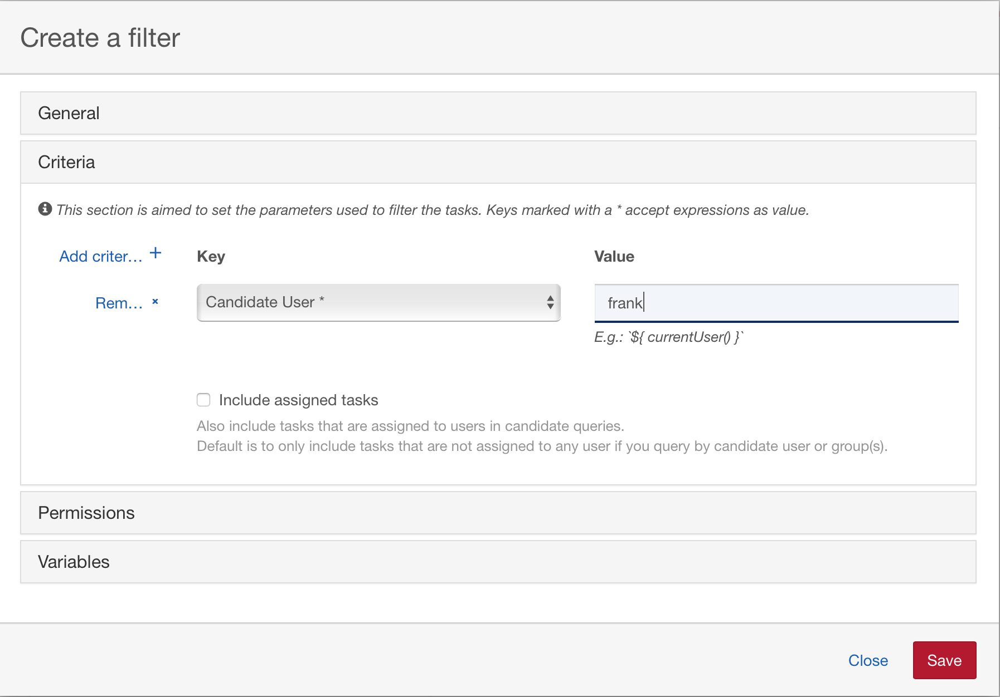
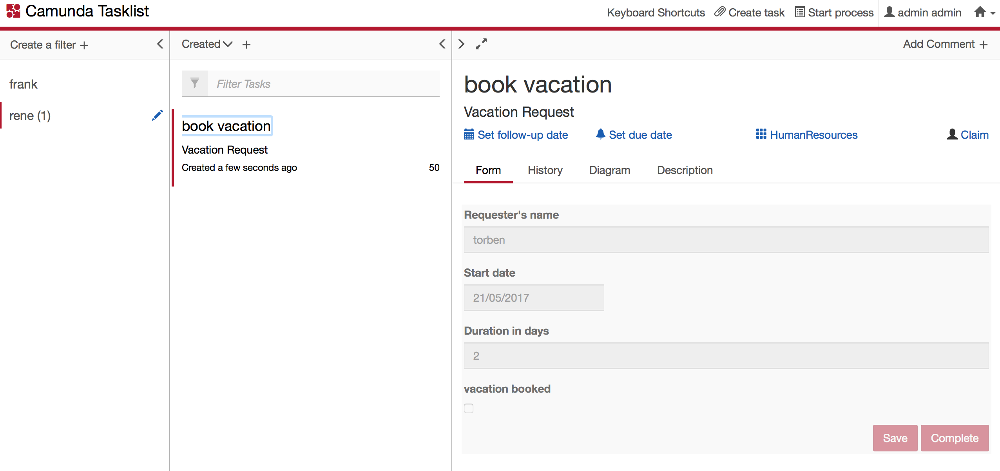

# K+N Vacation-Request via Camunda Process Engine and Spring Boot

This example demonstrates how to bootstrap the Camunda process engine with 
[Camunda Spring Boot](https://github.com/camunda/camunda-bpm-spring-boot-starter). 

Therefore a vacation example.approval request process was taken as an example, which uses a 
DMN table for the task assignment. 
* BPMN-Process

* DMN-Table

## Get started
To startup the vacation-request example.approval type `mvn spring-boot:run` on the console or 
execute the Java class `VacationRequestApplication` from within your IDE. 
Please consider, that this project requires to run the Immutables annotation processor, which can 
be activated in your IDE via [Using annotation processor in IDE](https://immutables.github.io/apt.html).

Anyway if you are using maven or your IDE, afterwards you can reach the web app under: 
* [http://localhost:9090/](http://localhost:9090/)

## Login
The first login requires the setup of a user, as you can see here: 

 
## Process-Start
Open the Tasklist in the camunda-cockpit 

open the dialog to start a process

and start the `Vacation Request` process

and enter the needed input variables 

## Tasklist-Filter
Create a Tasklist-Filter for all active tasks 

## Work on user tasks 
Approve vacation request via 
* claim
* example.approval
* save
* complete

Book vacation via 
* claim
* vacation booked
* save
* complete

